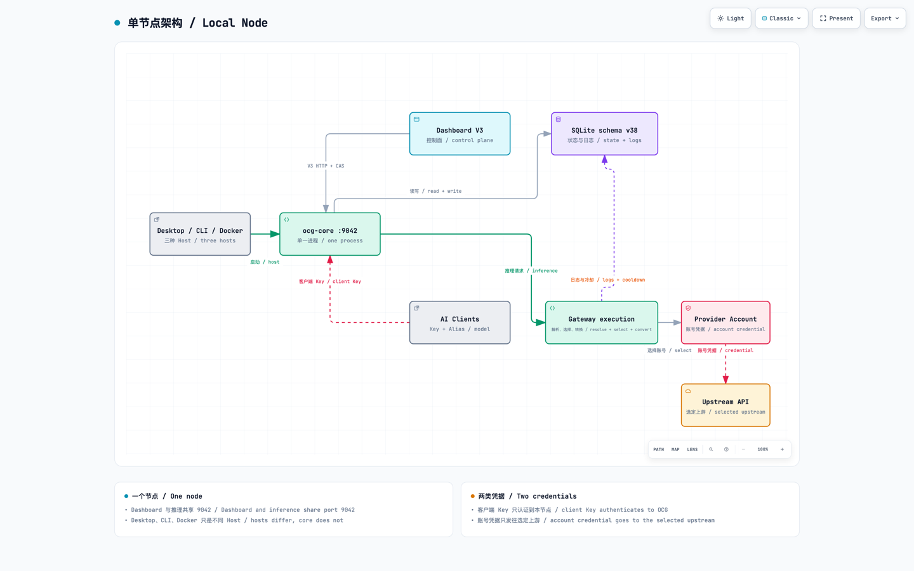

[English](architecture.md)

# 架构

Open Console Gateway 是一个本地节点。Desktop、CLI 与 Docker 只是承载同一
`ocg-core` 进程的不同 Host。默认监听地址为 `127.0.0.1:9042`。每个节点把数据保存在本地。

## 一个本地节点

[在 GitHub Pages 打开交互图](https://klarkxy.github.io/open-console-gateway/diagrams/local-node/)可以切换主题、追踪关系或导出其他格式。

Dashboard 与推理入口共用 `9042`，但使用两类不同凭据。客户端 **Key** 用于 AI
工具向 Open Console Gateway 鉴权；选定账号后，账号凭据只会发往该账号配置的上游，Zen
Free 没有凭据。Vue SPA 只通过 HTTP Dashboard V4 通信。仅保留 auth 与 browser WS 两个 V2
兼容族。

## 请求生命周期

一次推理请求按固定顺序执行：

1. 使用 `access_keys` 中的客户端 **Key** 完成鉴权。
2. 解析客户端协议，并解析 Alias、精确内置 raw ID、用户定义 Provider 公开模型，
   或符合条件的 Custom 模型 ID。
3. 物化兼容账号，再按卡片顺序应用严格优先、全局粘性或轮询策略。
4. 由密封适配器构建一次尝试，解析所选账号凭据，并发送一次上游请求。协议选择
   使用已保存的合约。
5. 把响应或 SSE 流转换回客户端格式，随后记录请求身份、上游身份、用量与冷却状态。

未知模型返回 `400`。有歧义的精确 raw ID 返回 `ambiguous_model_id`，并停留在本地。
符合条件的发送前错误或 Provider 特定错误可以继续账号 fallback；有歧义或不安全的
请求在账号选择前失败。

## 产品归属

| 界面 | 负责 | 相关界面 |
| --- | --- | --- |
| **访问密钥** | 面向客户端的主 Key 与子 Key | 账号凭据在 **账号** |
| **账号** | 账号 Key、启停、顺序、备注、冷却与用量状态 | 目录与协议合约在 **供应商** |
| **供应商** | 内置目录、模型/协议合约，以及用户定义 Provider 的 Endpoint/鉴权/映射 | Custom API 映射留在账号卡 |
| **Custom API 账号** | 一个 API URL、一个账号级上游协议、公开模型 → 上游 ID 映射 | 共享 Provider 定义在 **供应商** |
| **扩展 / CPA** | 一个静态本机外部集成边界 | 内置路由家族仍在 **账号** / **供应商** |
| **应用 / DSH** | 安装到 DSH `web` profile 的 OCG 自有插件 | 客户端使用普通 Gateway API |

Adapter Registry 静态密封。用户定义 Provider 仅作为类型化数据持久化，并始终绑定
Configurable HTTP。

## 本地模型列表

这些读取使用已保存的本地状态。目录刷新由 **供应商** 页显式触发。

| Endpoint | 公布内容 |
| --- | --- |
| 已鉴权 `GET /v1/models` | 当前合格的公开名称（代码持有 Alias、已保存 Zen/Command/CN 映射、用户定义 Provider 公开模型，以及符合条件的 Custom 声明 ID），每行都带与 enrich 同一快照推导并校验过的协议配置 |
| `GET /dashboard/api/v4/application-models` | 已保存目录中可解析且协议已启用的 Go 名称；不查阅价格快照。不含 Custom API、用户定义 Provider 与 CN Plan |

新发现的 MiniMax CN、Kimi CN 与 GOAT 目录行从完整已保存目录的最后一节生成唯一归一化小写 kebab Alias，包括不含 `/` 的 ID；已保存旧别名保持不变。升级过的 Nemotron 只保留旧的短别名，新增目录行使用完整的最后一节名称。保存的 Kimi 滚动名称保持不变，新发现的 `k3` 使用 `k3`。归一化后重名或占用 Go 原始名称的行不公布别名；每一行都保留精确 raw ID。与已公布内置 Alias 冲突的
Custom ID 不会进入公布列表。

## 协议转换

客户端可以使用 OpenAI Chat Completions、OpenAI Responses、Anthropic Messages 或
Gemini `generateContent` / `streamGenerateContent` 入口。每一次尝试在发送前于本地选择一种上游协议：已保存首选、已启用的客户端协议，然后是其余已授权协议。该选择与客户端协议不同时，请求和响应会做转换。Gemini 是客户端格式，从不是上游协议。凭据与供应商重试仍沿用既有策略。HTTP 400 不换协议。

选择规则、原生不透明历史和转换限制见[协议转换](protocol-conversion.zh-CN.md)。

## 继续阅读

| 任务 | 指南 |
| --- | --- |
| 安装并接入客户端 | [安装](install.zh-CN.md)、[首个客户端](first-client.zh-CN.md) |
| 添加账号并排序 | [账号](accounts.zh-CN.md)、[路由](routing.zh-CN.md) |
| 管理目录与合约 | [供应商](providers.zh-CN.md) |
| 理解 Alias 与错误 | [Gateway](gateway.zh-CN.md) |
| 接入 DSH 插件 | [应用](applications.zh-CN.md) |
| 查看 crate 与 Host 边界 | [维护者架构](../maintainer/architecture.zh-CN.md) |

---

[用户指南索引](../USER.zh-CN.md) · [English](architecture.md) · [文档索引](../README.zh-CN.md)
